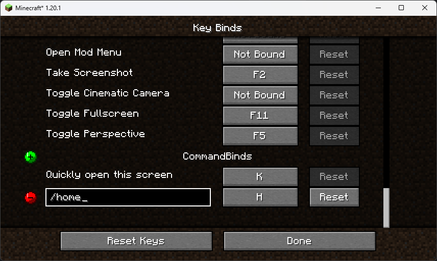

<div align="center">

<picture>
  <source media="(prefers-color-scheme: dark)" srcset=".github/screenshot.png">
  <source media="(prefers-color-scheme: light)" srcset=".github/screenshot.png">
  
</picture>

# CommandBinds

[![Downloads](https://img.shields.io/modrinth/dt/commandbinds?logo=data:image/png;base64,iVBORw0KGgoAAAANSUhEUgAAABAAAAAQCAYAAAAf8/9hAAABhWlDQ1BJQ0MgcHJvZmlsZQAAKJF9kT1Iw0AcxV9bxSIVh1YQcYhQnSyIiuimVShChVArtOpgcukXNGlIUlwcBdeCgx+LVQcXZ10dXAVB8APE0clJ0UVK/F9SaBHjwXE/3t173L0D/PUyU82OMUDVLCOViAuZ7KrQ9YogwujDEGYkZupzopiE5/i6h4+vdzGe5X3uz9Gj5EwG+ATiWaYbFvEG8dSmpXPeJ46woqQQnxOPGnRB4keuyy6/cS447OeZESOdmieOEAuFNpbbmBUNlXiSOKqoGuX7My4rnLc4q+Uqa96TvzCU01aWuU5zEAksYgkiBMioooQyLMRo1UgxkaL9uId/wPGL5JLJVQIjxwIqUCE5fvA/+N2tmZ8Yd5NCcaDzxbY/hoGuXaBRs+3vY9tunACBZ+BKa/krdWD6k/RaS4seAb3bwMV1S5P3gMsdoP9JlwzJkQI0/fk88H5G35QFwrdA95rbW3Mfpw9AmrpK3gAHh8BIgbLXPd4dbO/t3zPN/n4Ax9dyyerighsAAAAGYktHRAAAAAAAAPlDu38AAAAJcEhZcwAADdcAAA3XAUIom3gAAAAHdElNRQfmCBMVIw496dpyAAACm0lEQVQ4y2XTTYjVdRTG8c/vd//33sQJZyEVrYZeNJ1BSgKTsVbekRRbZVSrIqHwNUxtFVkboXyBQnORK6kICXQxSaOG0oSQiJAz4xuaUWvvCFdr7p37Py0Uszyrs3j4HnjO8yT/n4mhATlWS5YKfSC5JhxTpi/NHxm7V57ubuOrairN3aR30BRpWI4rIDyB5eiVfGG69z39B9v/AsZX1VQmj+AF4UM9rd2m63XtYsBUfdyC4aY/Fs9wc+Ym0jac1O1drv9gu4A7l5+nXInTWg/uk+I1VNWnHnexscUtj5rOm1TLs8JhxY0d2JBNDA2Q3ha2mS5+kfKoFK8I26W8yJxjv+Gq8KqiHDVVO0X6SMQa48v6sxyrMamntVu13IU+kZaoxS5RLnRp6T5FHBRpEI+ptXeK+Ik0pVJ+loUGvjddrwuvC58oKmM66RD2CrM0m7fMGzkj4lvhTckJoi48k1xovKRMV+WYhVEpL6KcLQyTVntqZP/tT6yqOD+5TDZMfpfubGzM9+UgpwqpDzeleNr5xpALjbMuTu4krt+GxWkpdSAL2+V4XzXGiI6y+52IPZJzwjrJD5IeRdopW4G2ojKmdBOXs+QoVujkvaSqiEfktNHco4tFvKxMQ2LGQtPxMGkLDmj3/K3s/Vyr+Vwy1hhUGJXiL/LHyvINKfURnyoNKyuXFOU8HBeueKAzqF3dIKzTrs3NBo7+jBGRqsSvOvXF+Jq0VU6nFOVWZfdP4iud2hKdYlD4AN9YMNy8bWK3dyVOCofVOmvNbK1VjYewRDcfMP/H37VmrFdvr1emQyKd0Lq++f4yFTd2iFiDSRyRXL7j+hzSi5iFPVrXN3v2TOe/gLugZf1y9y0pNbhTZ64JI4pyvyePT9wr/wdL6hgY+Xe2UgAAAABJRU5ErkJggg==)](https://modrinth.com/mod/commandbinds/)
[](https://discord.gg/kHWFx7bFZh)

<big><b>CommandBinds allows you to bind commands to keys the vanilla way.</b></big>

</div>

There are 3 ways to get to the Key Binds screen.

1) Options > Controls > Key Binds
2) Mod Menu > CommandBinds > Configure
3) Press `K` key when in-game

You can add or remove entries using the provided buttons on the left side. Just type the command you want in the textbox. Then click the button and assign the key you want.

## Supported Platforms

* [Fabric](https://fabricmc.net/) (requires [Fabric API](https://modrinth.com/mod/fabric-api))

## Downloads

Downloads are available on Modrinth.

[](https://modrinth.com/mod/commandbinds)

## Building from source

Then just run the following command:

```shell
./gradlew build
```

The compiled jars will be in `build/libs/`
